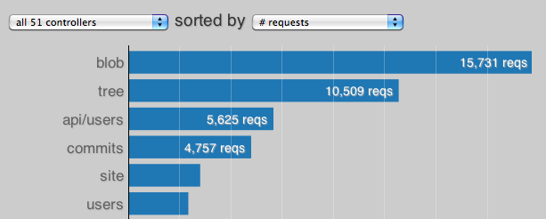
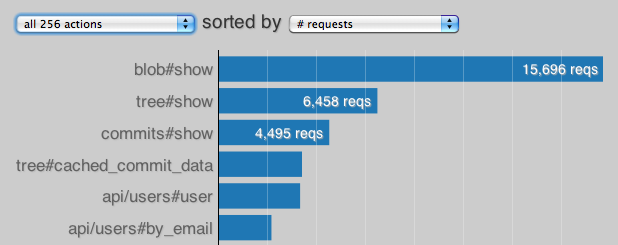
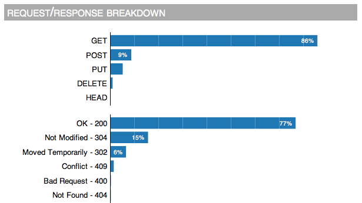
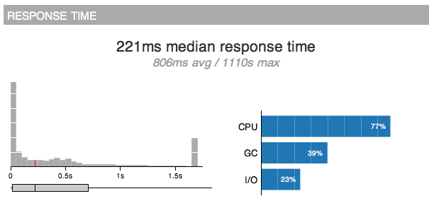
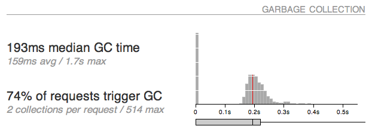
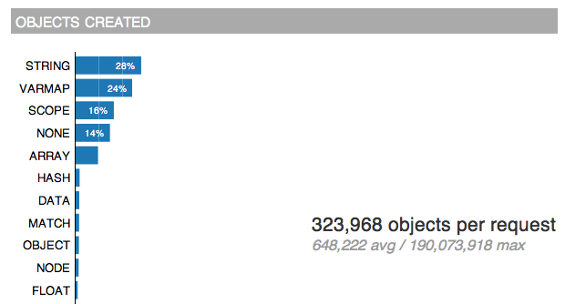
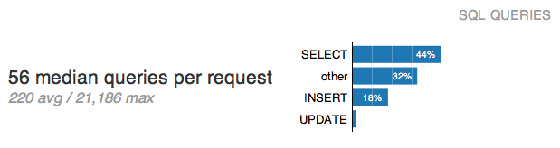
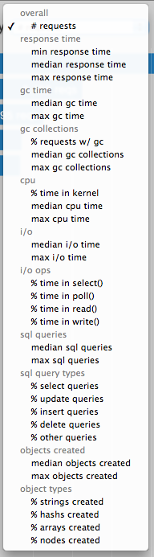

# hotspots

a rails performance tool.

## collecting data

``` ruby
require 'memprof/tracer'
config.middleware.use Memprof::Tracer
```

The `Memprof::Tracer` middleware will record JSON stats about each
incoming request to `/tmp/memprof_tracer-PID.json`

## analyzing data

```
bundle install
./bin/hotspots /tmp/memprof_tracer-*.json hotspots-report/
open hotspots-report/index.html
```

## screenshots

### summary


### top controllers and actions




### request/response types



### response time



### gc and objects




### sql



### sort options


